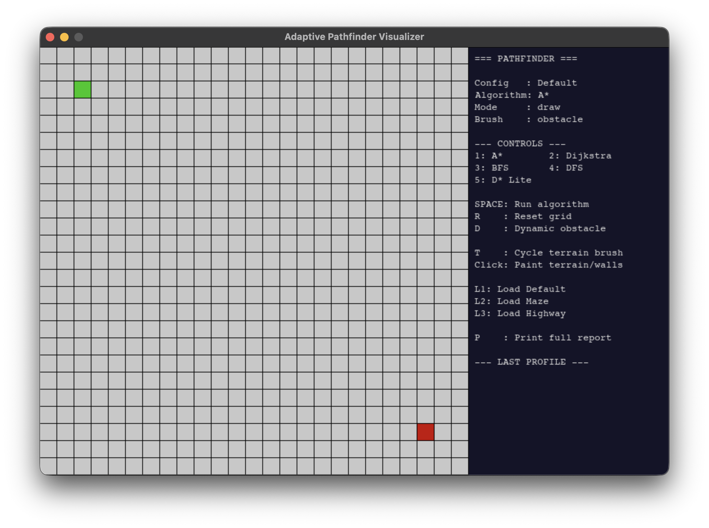

<div align="center">
    
# 🧭 Adaptive Pathfinding Visualizer


A **systems-level pathfinding benchmarking tool** built with Python and Pygame. Paint terrain, run algorithms, insert dynamic obstacles mid-search, and profile performance — all in real time.

> Upgraded from [PathfindingProject](https://github.com/DeekshithaKalluri/PathfindingProject) (CIS 730 — AI course), which benchmarked 5 algorithms in Jupyter. This version adds a real-time interactive visualizer, weighted terrain, D* Lite replanning, and an automated performance profiler.

</div>

---

## 📸 Demo



---

## ✨ Features

| Feature | Description |
|--------|-------------|
| 🗺️ Weighted Terrain | Paint mud (cost 5), highway (cost 0.5), or walls |
| 🤖 5 Algorithms | A\*, Dijkstra, BFS, DFS, D\* Lite |
| ⚡ D\* Lite Replanning | Insert obstacles mid-search without restarting |
| 📊 Performance Profiler | Logs nodes visited, time (ms), memory (KB) per run |
| 🗂️ Grid Presets | Load Default, Maze, or Highway configs from JSON |
| 🎨 Live Painting | Click/drag to draw terrain while the app runs |

---

## 🚀 Setup

```bash
git clone https://github.com/DeekshithaKalluri/pathfinder-visualizer.git
cd pathfinder-visualizer
python3 -m venv venv
source venv/bin/activate
pip install pygame networkx psutil
python main.py
```

---

## 🎮 Controls

| Key | Action |
|-----|--------|
| `1` | A\* Algorithm |
| `2` | Dijkstra |
| `3` | BFS |
| `4` | DFS |
| `5` | D\* Lite |
| `SPACE` | Run selected algorithm |
| `T` | Cycle terrain brush (obstacle → mud → highway → normal) |
| Click/Drag | Paint terrain on grid |
| `R` | Reset grid |
| `D` | Insert dynamic obstacle + D\* Lite replan |
| `F1` | Load Default preset |
| `F2` | Load Maze preset |
| `F3` | Load Highway preset |
| `P` | Print full benchmark report to terminal |

---

## 🏗️ Project Structure

```
pathfinder_visualizer/
├── main.py                  # Entry point, event loop
├── grid.py                  # Cell, terrain costs, grid logic
├── renderer.py              # Pygame drawing, UI panel
├── algorithms/
│   ├── astar.py             # A* with terrain-weighted heuristic
│   ├── dijkstra.py          # Dijkstra with weighted edges
│   ├── bfs.py               # Breadth-First Search
│   ├── dfs.py               # Depth-First Search
│   └── dstar_lite.py        # D* Lite with dynamic replanning
├── profiler/
│   └── profiler.py          # Nodes, time, memory benchmarking
└── configs/
    ├── default.json          # Open grid preset
    ├── maze.json             # Wall maze preset
    └── highway.json          # Highway + mud regions preset
```

---

## 🧠 Algorithm Comparison

| Algorithm | Optimal Path? | Terrain-Aware? | Dynamic Replan? |
|-----------|:---:|:---:|:---:|
| A\* | ✅ | ✅ | ❌ |
| Dijkstra | ✅ | ✅ | ❌ |
| BFS | ❌ (unweighted) | ❌ | ❌ |
| DFS | ❌ | ❌ | ❌ |
| D\* Lite | ✅ | ✅ | ✅ |

---

## 📈 What the Profiler Tracks

Every time you run an algorithm, the profiler logs:

- **Nodes visited** — how many cells were explored before finding the path
- **Time (ms)** — wall-clock execution time using `perf_counter`
- **Memory delta (KB)** — RSS memory change via `psutil`

Press `P` in the app to print a full comparison table across all runs in the terminal.

---

## 🌍 Terrain Cost Model

| Terrain | Color | Move Cost |
|---------|-------|-----------|
| Normal | Gray | 1 |
| Mud | Brown | 5 |
| Highway | Yellow | 0.5 |
| Obstacle | Black | ∞ (impassable) |

Algorithms that use cost (A\*, Dijkstra, D\* Lite) will naturally route around mud and prefer highways. BFS and DFS ignore cost entirely.

---

## 🔗 Related

- **Base project:** [PathfindingProject](https://github.com/DeekshithaKalluri/PathfindingProject) — Academic comparative study of 5 pathfinding algorithms (CIS 730, AI course). Includes full written report and statistical benchmarks across randomized grids.

---

## 📄 License

MIT — see [LICENSE](LICENSE)
